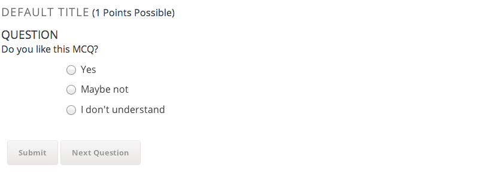
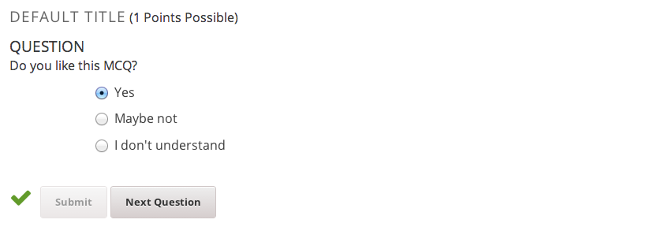
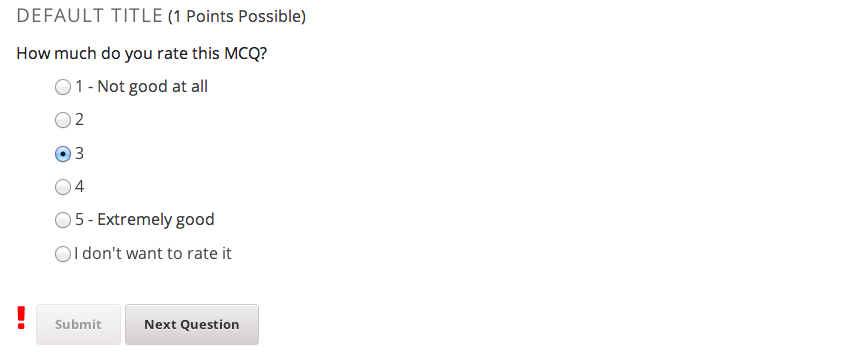
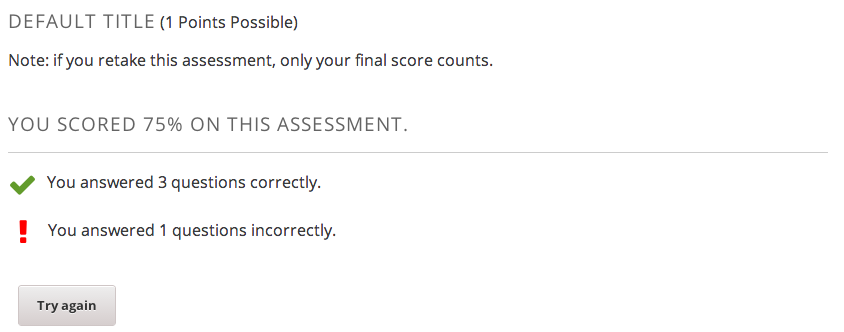

Problem Builder XBlock
----------------------

[](https://travis-ci.org/open-craft/xblock-problem-builder)

This XBlock allows creation of questions of various types and simulating the
workflow of real-life mentoring, within an edX course.

It supports:

* **Free-form answers** (textarea) which can be shared accross
  different XBlock instances (for example, to allow a student to
  review and edit an answer he gave before).
* **Self-assessment MCQs** (multiple choice), to display predetermined
  feedback to a student based on his choices in the
  self-assessment. Supports rating scales and arbitrary answers.
* **MRQs (Multiple Response Questions)**, a type of multiple choice
  question that allows the student to choose more than one choice.
* **Answer recaps** that display a read-only summary of a user's
  answer to a free-form question asked earlier in the course.
* **Progression tracking**, to require that the student has
  completed a particular step before allowing them to complete the
  next step. Provides a link to the next step to the student.
* **Tables**, which allow to present answers from the student to
  free-form answers in a concise way. Supports custom headers.

The screenshot shows an example of a problem builder block containing a
free-form question, two MCQs and one MRQ.


Installation
------------

Install the requirements into the python virtual environment of your
`edx-platform` installation by running the following command from the
root folder:

```bash
$ pip install -r requirements.txt
```

Enabling in Studio
------------------

You can enable the Problem Builder XBlock in studio through the advanced
settings.

1. From the main page of a specific course, navigate to `Settings ->
   Advanced Settings` from the top menu.
2. Check for the `advanced_modules` policy key, and add `"problem-builder"`
   to the policy value list.
3. Click the "Save changes" button.

Usage
-----

When you add the `Problem Builder` component to a course in the studio, the
built-in editing tools guide you through the process of configuring the
block and adding individual questions.

### Problem Builder modes

There are 2 mentoring modes available:

* *standard*: Traditional mentoring. All questions are displayed on the
  page and submitted at the same time. The students get some tips and
  feedback about their answers. This is the default mode.

* *assessment*: Questions are displayed and submitted one by one. The
  students don't get tips or feedback, but only know if their answer was
  correct. Assessment mode comes with a default `max_attempts` of `2`.

Below are some LMS screenshots of a problem builder block in assessment mode.

Question before submitting an answer:



Question after submitting the correct answer:



Question after submitting a wrong answer:



Score review and the "Try Again" button:



### Free-form Question

Free-form questions are represented by a "Long Answer" component. 

Example screenshot before answering the question:


Screenshot after answering the question:


You can add "Long Answer Recap" components to problem builder blocks later on
in the course to provide a read-only view of any answer that the student
entered earlier.

The read-only answer is rendered as a quote in the LMS:


### Multiple Choice Questions (MCQ)

Multiple Choice Questions can be added to a problem builder component and
have the following configurable options:

* Question - The question to ask the student
* Message - A feedback message to display to the student after they
  have made their choice.
* Weight - The weight is used when computing total grade/score of
  the problem builder block. The larger the weight, the more influence this
  question will have on the grade. Value of zero means this question
  has no influence on the grade (float, defaults to `1`).
* Correct Choice - Specify which choice[s] is considered correct. If
  a student selects a choice that is not indicated as correct here,
  the student will get the question wrong.

Using the Studio editor, you can add "Custom Choice" blocks to the MCQ.
Each Custom Choice represents one of the options from which students
will choose their answer.

You can also add "Tip" entries. Each "Tip" must be configured to link
it to one or more of the choices. If the student chooses a choice, the


Screenshot: Before attempting to answer the questions:


While attempting to complete the questions:


After successfully completing the questions:


#### Rating MCQ

When constructing questions where the student rates some topic on the
scale from `1` to `5` (e.g. a Likert Scale), you can use the Rating
question type, which includes built-in numbered choices from 1 to 5
The `Low` and `High` settings specify the text shown next to the
lowest and highest valued choice.

Rating questions are a specialized type of MCQ, and the same
instructions apply. You can also still add "Custom Choice" components
if you want additional choices to be available such as "I don't know".


### Self-assessment Multiple Response Questions (MRQ)

Multiple Response Questions are set up similarly to MCQs. The answers
are rendered as checkboxes. Unlike MCQs where only a single answer can
be selected, MRQs allow multiple answers to be selected at the same
time.

MRQ questions have these configurable settings:

* Question - The question to ask the student
* Required Choices - For any choices selected here, if the student
  does *not* select that choice, they will lose marks.
* Ignored Choices - For any choices selected here, the student will
  always be considered correct whether they choose this choice or not.
* Message - A feedback message to display to the student after they
  have made their choice.
* Weight - The weight is used when computing total grade/score of
  the problem builder block. The larger the weight, the more influence this
  question will have on the grade. Value of zero means this question
  has no influence on the grade (float, defaults to `1`).
* Hide Result - If set to True, the feedback icons next to each
  choice will not be displayed (This is false by default).

The "Custom Choice" and "Tip" components work the same way as they
do when used with MCQs (see above).

Screenshot - Before attempting to answer the questions:


While attempting to answer the questions:


After clicking on the feedback icon next to the "Its bugs" answer:


After successfully completing the questions:


### Tables

The problem builder table allows you to present answers to multiple
free-form questions in a concise way. Once you create an "Answer
Recap Table" inside a Mentoring component in Studio, you will be
able to add columns to the table. Each column has an optional
"Header" setting that you can use to add a header to that column.
Each column can contain one or more "Answer Recap" element, as
well as HTML components.

Screenshot:


### Maximum Attempts

You can set the number of maximum attempts for the unit completion by
setting the Max. Attempts option of the Mentoring component.

Before submitting an answer for the first time:


After submitting a wrong answer two times:


### Custom tip popup window size

You can specify With and Height attributes of any Tip component to
customize the popup window size. The value of those attribute should
be valid CSS (e.g. `50px`).

Workbench installation and settings
-----------------------------------

Install to the workbench's virtualenv by running the following command from the
problem builder repo root:

```bash
pip install -r requirements.txt
```

In the main XBlock repository, create the following configuration file
in `workbench/settings_pb.py` in the XBlock repository:

```python
from settings import *

INSTALLED_APPS += ('problem_builder',)
DATABASES['default']['NAME'] = 'workbench.sqlite'
```

Because this XBlock uses a Django model, you need to sync the database
before starting the workbench. Run this from the XBlock repository
root:

```bash
$ ./manage.py syncdb --settings=workbench.settings_pb
```

Running the workbench
---------------------

```bash
$ ./manage.py runserver 8000 --settings=workbench.settings_pb
```

Access it at [http://localhost:8000/](http://localhost:8000).

Running tests
-------------

First, make sure the [XBlock SDK (Workbench)](https://github.com/edx/xblock-sdk)
is installed in the same virtual environment as xblock-problem-builder.

From the xblock-problem-builder repository root, run the tests with the
following command:

```bash
$ ./run_tests.py
```

If you want to run only the integration or the unit tests, append the directory to the command. You can also run separate modules in this manner.

```bash
$ ./run_tests.py problem_builder/tests/unit
```

Extracting Translatable Strings
-------------------------------

To extract/update strings for translation, you will need i18n_tools:

```bash
pip install git+https://github.com/edx/i18n-tools.git#egg=i18n_tools
```

To extract strings, use `i18n_tool extract`. To build a dummy translation for
testing, use:

```bash
i18n_tool dummy && i18n_tool generate
```


Adding custom scenarios to the workbench
----------------------------------------

Within the xblock-problem-builder repository, create the `templates/xml` and
add XML scenarios to it - all files with the `*.xml` extension will be
automatically loaded by the workbench:

```bash
$ mkdir templates/xml
$ cat > templates/xml/my_pb_scenario.xml
```

Restart the workbench to take the new scenarios into account.

Upgrading from Version 1
------------------------

To upgrade a course from xblock-mentoring ("v1") to xblock-problem-builder
("v2"), run the following command on a system with edx-platform,
xblock-mentoring, and xblock-problem-builder installed:

```bash
$ SERVICE_VARIANT=cms DJANGO_SETTINGS_MODULE="cms.envs.devstack" python -m problem_builder.v1.upgrade "Org/Course/Run"
```
Where "Org/Course/Run" is replaced with the ID of the course to upgrade.

License
-------

This XBlock is available under the GNU Affero General Public License (AGPLv3).
