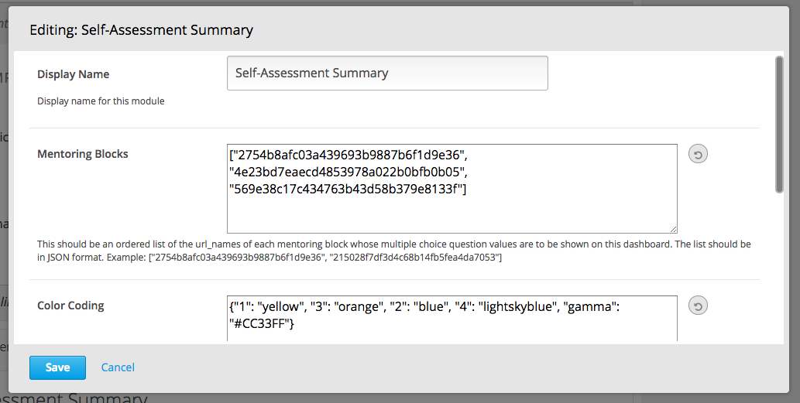
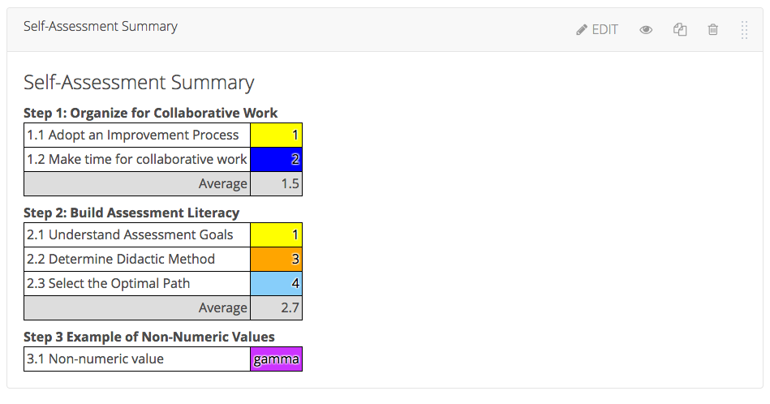
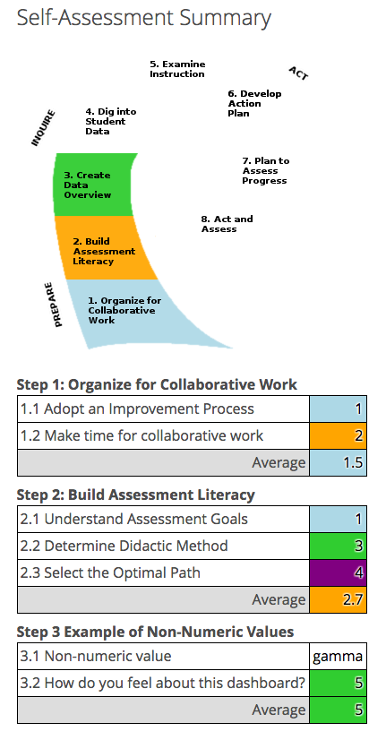
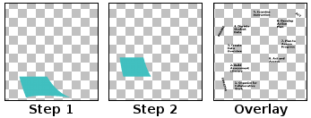
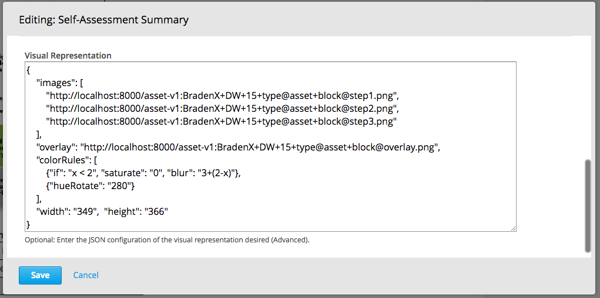

"Dashboard" Self-Assessment Summary Block
=========================================

A "Dashboard" XBlock provides a concise way to summarize a student's answers to
groups of multiple choice questions.

You configure it like this, by pasting in the `url_name`s of some Problem
Builder ("Mentoring") blocks:

And it will then look like this (after a student has submitted their answers):

Color Coding Rules:
-------------------

Authors can add a list of rules (one per line) that apply colors to the various
possible student answer values.

Rules are entered into the dashboard configuration "Color Coding Rules", one
rule per line. The first rule to match a given value will be used to color
that value.

The simplest rule looks like "3: red". With this line, if the student's answer
is 3, it will be shown in red in the report. Colors can be specified using any
valid CSS color value, e.g. "red", "#f00", "#ff0000", "rgb(255,0,0)", etc.

For more advanced rules, you can use an expression in terms of x such as
"x > 3: blue" or "0 <= x < 5: green" (green if x is greater than or equal to
zero but less than five).

You can also just specify a color on a line by itself, which will always match
any value (usually this would be the last line, as a "default" color).

Visual Representation
---------------------

The Dashboard also supports an optional visual representation. This is a
powerful feature, but setting it up is a bit involved.

The end result is shown below. You can see a diagram, in which a colored arrow
appears as the student works through the various "Steps". Each "Step" is one
mentoring block, which contains several multiple choice questions. Based on the
average value of the student's choices, the step is given a color.

In this example, steps that have not been attempted are grey-green, and steps
that have been attempted are colored in according to the color coding rules.

To achieve the result shown above requires a set of "stacked" image files (one
for each step), as well as an overlay image (in this case, the overlay image
contains all the text). For coloring to work, the images must be white where
color is desired.

To build this example, the images used look like this:  

The block was configured to use these images as follows:

The **Visual Representation Settings** used to define the visual representation
must be in JSON format. The supported entries are:

* **`"images"`**: A list of image URLs, one per PB block, in the same order as
  the 'blocks' list (the list of `url_name`s described above). If the images you
  wish to use are on your computer, first upload them to the course's "Files and
  Uploads" page. You can then find the URL for each image listed on that page
  (use the "Studio" URL, not the "Web" URL).
    * All images listed here will be layered on top of each other, and can be
    colorized, faded, etc. based on the average value of the student's choices
    for the corresponding group of MCQs.
* **`"overlay"`**: (Optional) The URL of an image to be drawn on top of the
  layered images, with no effects applied.
* **`"background"`**: (Optional) The URL of an image to be drawn behind the
  layered images, with no effects applied.
* **`"width"`**: (Important) The width of the images, in pixels (all images
  should be the same size).
* **`"height"`**: (Important) The height of the images, in pixels

Enabling in Studio
------------------

You can enable the Dashboard XBlock in Studio by modifying the advanced settings
for your course:

1. From the main page of a specific course, navigate to **Settings** ->
   **Advanced Settings** from the top menu.
2. Find the **Advanced Module List** setting.
3. Add `"pb-dashboard"` to the modules listed there.
4. Click the **Save changes** button.
