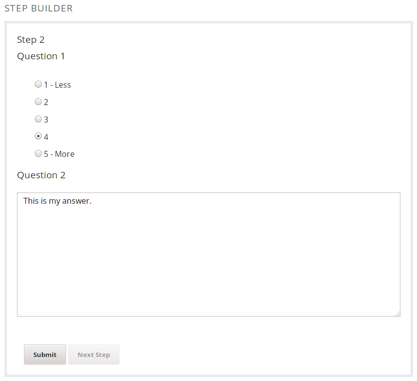
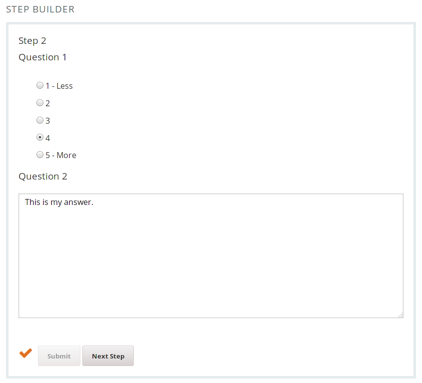
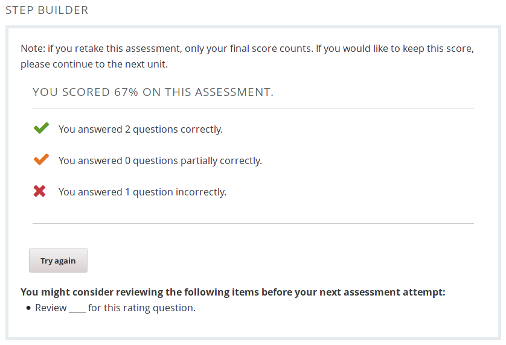
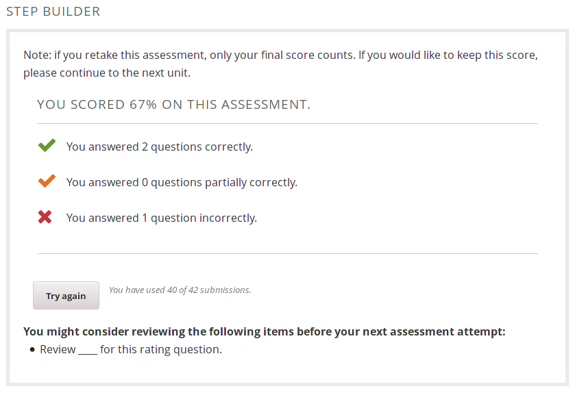
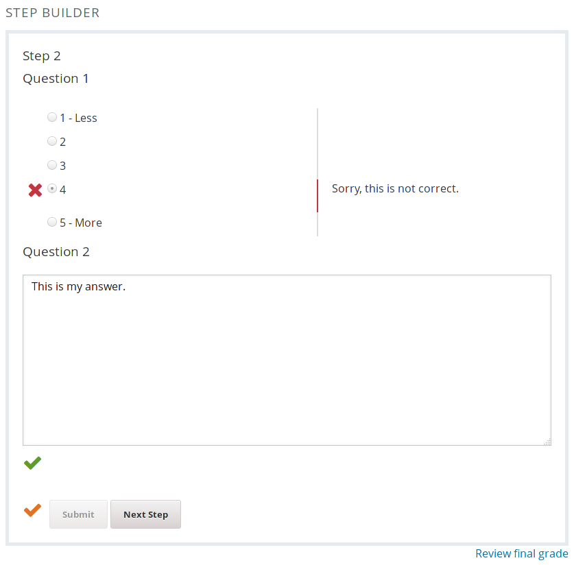
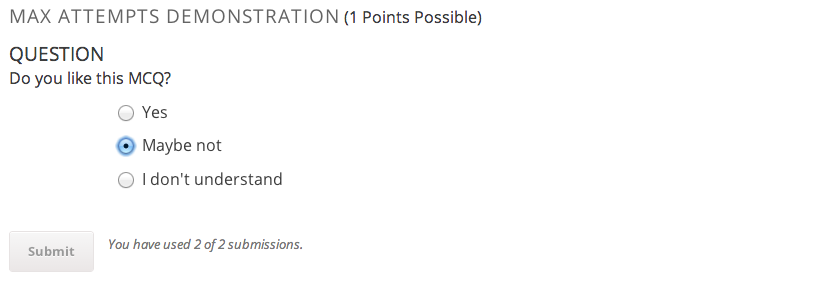

Step Builder Usage
==================

The Step Builder is similar to Problem Builder, but it allows authors to group
questions into explict steps, and provide more detailed feedback to students.

Instead of adding questions to Step Builder itself, you'll need to add one or
more **Mentoring Step** blocks to Step Builder. You can then add one or more
questions to each step. This allows you to group questions into logical units
(without being limited to showing only a single question per step). As students
progress through the block, Step Builder will display one step at a time. All
questions belonging to a step need to be completed before the step can be
submitted.

In addition to regular steps, Step Builder can also contain a **Review Step**
component which:

* allows students to review their performance

* allows students to jump back to individual steps to review their
  answers (if **Extended feedback** setting is enabled on the Step Builder block
  and the maximum number of attempts has been reached.)

* supports "conditional messages" that will can shown during the review step
  based on certain conditions such as:

  * the student achieved a perfect score, or not
  * the student is allowed to try again, or has used up all attempts

**Screenshots: Step**

Step with multiple questions (before submitting it):

Step with multiple questions (after submitting it):

As indicated by the orange check mark, this step is *partially*
correct (i.e., some answers are correct and some are incorrect or
partially correct).

**Screenshots: Review Step**

Unlimited attempts available, all answers correct, and a conditional message
that says "Great job!" configured to appear if the student gets a perfect score:

Limited attempts, some attempts remaining, some answers incorrect, and a custom
review/study tip.

Limited attempts, no attempts remaining, extended feedback off:

Limited attempts, no attempts remaining, extended feedback on:

**Screenshots: Step-level feedback**

Reviewing performance for a single step:

Configuration Options
---------------------

### Maximum Attempts

You can limit the number of times students are allowed to complete a
Mentoring component by setting the **Max. attempts allowed** option.

Before submitting an answer for the first time:

After submitting a wrong answer two times:

